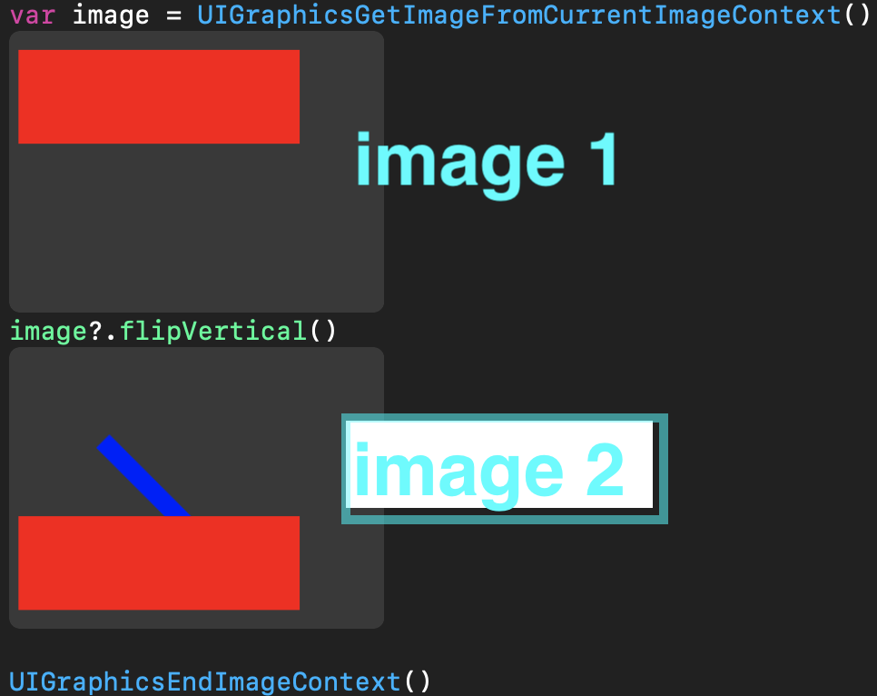

## 座標変換、画像の回転はどうやる？

以下はPlaygroundで動かす事が出来るコード。

[Swift4でUIImageの反転](https://qiita.com/knou/items/500d2af0ceaa6ac54958)

```swift
import UIKit
extension UIImage {
  //上下反転
  func flipVertical() -> UIImage {
    let scale: CGFloat = 1.0
    UIGraphicsBeginImageContextWithOptions(size, false, scale)
//    let imageRef = self.cgImage
    let context = UIGraphicsGetCurrentContext()!
    // Draw a red line
    context.setLineWidth(20.0)
    context.setStrokeColor(UIColor.blue.cgColor)
    context.move(to: CGPoint(x: 100, y: 100))
    context.addLine(to: CGPoint(x: 200, y: 200))
    context.strokePath()
    let imageRef = self.cgImage
    
    context.translateBy(x: 0, y:  0)
    context.scaleBy(x: 1.0, y: 1.0)
    context.draw(imageRef!, in: CGRect(x: 0, y: 0, width: size.width, height: size.height))
    let flipHorizontalImage = UIGraphicsGetImageFromCurrentImageContext()
    UIGraphicsEndImageContext()
    return flipHorizontalImage!
  }
  
  //左右反転
  func flipHorizontal() -> UIImage {
    let scale: CGFloat = 1.0
    UIGraphicsBeginImageContextWithOptions(size, false, scale)
    let imageRef = self.cgImage
    let context = UIGraphicsGetCurrentContext()
    context?.translateBy(x: size.width, y:  size.height)
    context?.scaleBy(x: -1.0, y: -1.0)
    context?.draw(imageRef!, in: CGRect(x: 0, y: 0, width: size.width, height: size.height))
    let flipHorizontalImage = UIGraphicsGetImageFromCurrentImageContext()
    UIGraphicsEndImageContext()
    return flipHorizontalImage!
  }
}
```
ここまでは、UIImageへのMonkey Patching
```swift
UIGraphicsBeginImageContext(CGSize(width: 400, height: 300))
UIColor.red.set()
UIRectFill(CGRect(x: 10, y: 20, width: 300, height: 100))
//context!.scaleBy(x: 1.0, y: -1.0)
var image = UIGraphicsGetImageFromCurrentImageContext()
image?.flipVertical()

UIGraphicsEndImageContext()

```

こうすりゃ、画像がこうなる。image2に線を引いて、image 1を引っ繰り返して、貼り付け(draw)すれば下図の様になる。

作製: 2019/09/19Th


これで行けるはずなんだが。

[画像をリサイズ](https://gist.github.com/uupaa/f77d2bcf4dc7a294d109)



## gitコマンド

次のコマンドで、localのcommitをremote(Github)へupload出来る。

```bash
git -u push origin master # originってのはremoteの別名
```

さて、localで作業したファイルをremoteへuploadしたら、

```bash
> git push -u origin master
To https://github.com/externvoid/flipPlayground.git
 ! [rejected]        master -> master (non-fast-forward)
error: failed to push some refs to 'https://github.com/externvoid/flipPlayground.git'
hint: Updates were rejected because the tip of your current branch is behind
hint: its remote counterpart. Integrate the remote changes (e.g.
hint: 'git pull ...') before pushing again.
hint: See the 'Note about fast-forwards' in 'git push --help' for details.
```

これはどう言う事なのか？要するにconflictを解消してmerge(pull)しなさい。と言ってる。重要なのは、***pullとはmerge***の事。

```bash
>git pull #fetch origin/master & merge
>vi #conflict resolved
>git cm -a
>git push #default動作、cloneしてきたorigin/masterへpush
# 初回は、git clone http://externvoid/repository/flipPlayG.git
# git push -u origin master
```

ちなみにlocalのファイル(working tree)をaddしておけば、ファイルを消しても取り戻せる

```bash
>git checkout .
```


```bash
> git br -a
* master
  remotes/origin/master
```

origin/masterってのがupstream(上流ブランチ)って事らしい。

## gitの不思議

過去のcommitを無しにしたくて、git logしてから、rebaseしようとしたら、

```bash
> git rebase -i ca45ef79a8964f61
fatal: It seems that there is already a rebase-merge directory, and
I wonder if you are in the middle of another rebase.  If that is the
case, please try
	git rebase (--continue | --abort | --skip)
If that is not the case, please
	rm -fr ".git/rebase-merge"
and run me again.  I am stopping in case you still have something
valuable there.

```

## Gist投稿のMarkdownへのimage貼り付け

```
qiita://github gist markdown image
```
## YouTube動画を埋め込める？

 <iframe src="https://www.youtube.com/embed/ycZzFc60eoA" width="640" height="360" frameborder="0" allowfullscreen></iframe>

[](http://www.youtube.com/watch?v=XHECZDy_ctg)
